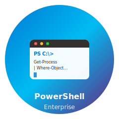

<div align="center">
  
  
  # PowerShell Automation Toolkit
  
  [](https://opensource.org/licenses/MIT)
  [](https://docs.microsoft.com/en-us/powershell/)
  [](https://www.microsoft.com/windows)
  [](https://lucchesi-sec.github.io/powershell-automation/)
  [](https://github.com/lucchesi-sec/powershell-automation/actions/workflows/powershell-ci.yml)
  
  [](https://github.com/lucchesi-sec/powershell-automation/commits/main)
  [](https://github.com/lucchesi-sec/powershell-automation/issues)
  [](https://github.com/lucchesi-sec/powershell-automation/network)
  [](https://github.com/lucchesi-sec/powershell-automation/stargazers)
  
  **A comprehensive collection of PowerShell modules and scripts for automation**
</div>

## Overview

This repository provides a suite of tools for automating common administrative and maintenance tasks in a Windows environment. The project is built around a core module, `PSAdminCore`, which provides essential functions for logging, notifications, reporting, and credential management.

## Features

-   **Core Module (`PSAdminCore`)**: A robust set of foundational functions.
-   **Administration Scripts**: Scripts for managing Active Directory, backups, and more.
-   **Maintenance Scripts**: Tools for system maintenance, such as disk cleanup and service monitoring.
-   **Extensible**: Designed to be easily extended with new scripts and modules.

## Getting Started

### Prerequisites

-   PowerShell 5.1 or later
-   Active Directory module (for AD-related scripts)

### Installation

1.  Clone the repository:
    ```sh
    git clone https://github.com/lucchesi-sec/powershell-automation.git
    ```
2.  Navigate to the repository directory:
    ```sh
    cd powershell-automation
    ```
3.  Import the core module:
    ```powershell
    Import-Module ./modules/PSAdminCore/PSAdminCore.psm1
    ```

## Usage

For detailed information on how to use the modules and scripts, please refer to our full documentation site.

## Documentation

-   **[Full Documentation](https://lucchesi-sec.github.io/powershell-automation/)** - Complete API reference and guides

## Contributing

Please read [CONTRIBUTING.md](CONTRIBUTING.md) for details on our code of conduct and the process for submitting pull requests.

## License

This project is licensed under the MIT License - see the [LICENSE.md](LICENSE.md) file for details.
