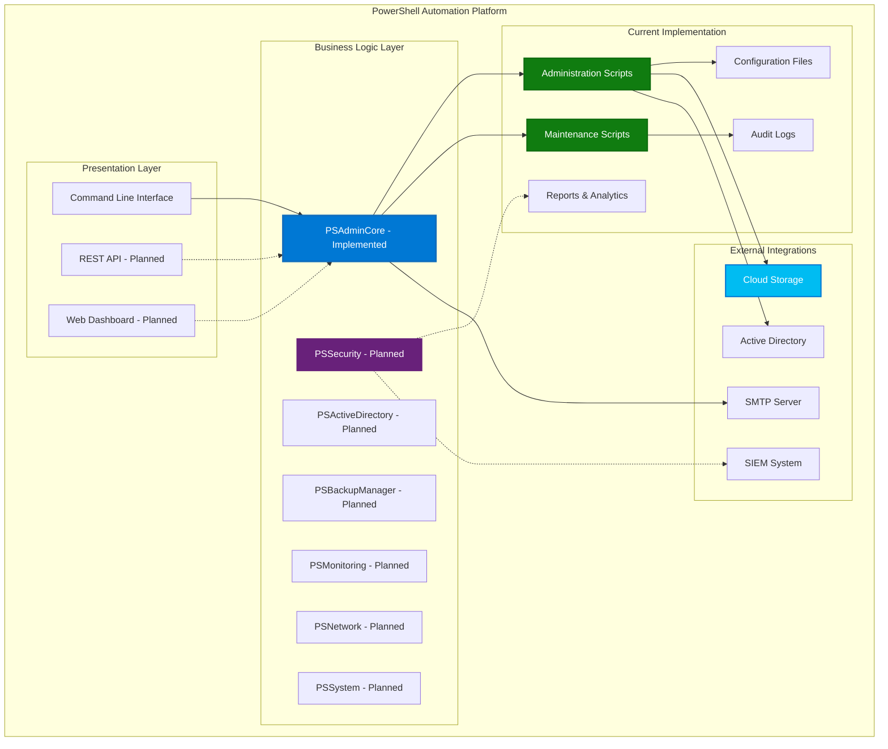
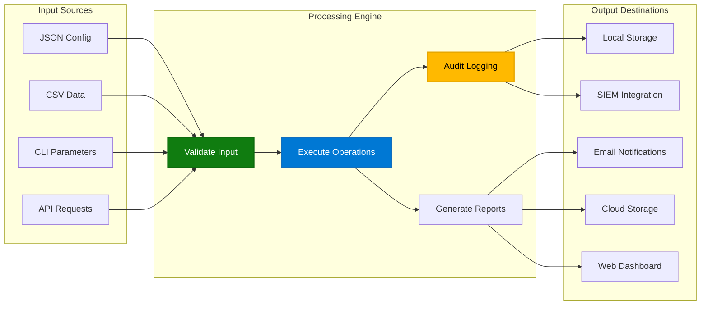
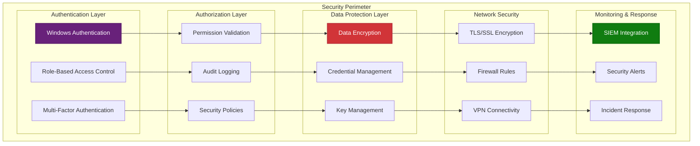

# Architecture of PowerShell Automation Platform

## Table of Contents
- [Overview](#overview)
- [Design Principles](#design-principles)
- [System Architecture](#system-architecture)
  - [Modular Structure](#modular-structure)
  - [Core Components](#core-components)
- [Data Flow](#data-flow)
- [Security Architecture](#security-architecture)
- [Integration Points](#integration-points)
- [Scalability and Performance](#scalability-and-performance)
- [Testing Framework](#testing-framework)
- [Deployment Model](#deployment-model)

## Overview
The PowerShell Automation Platform is designed to streamline IT operations through intelligent automation, focusing on Windows system administration, cybersecurity operations, and infrastructure management. The architecture is built to be modular, scalable, and secure, ensuring that it meets the needs of production environments.

## Design Principles
The platform adheres to the following design principles:
- **Modularity**: Components are organized into reusable modules to facilitate maintenance and scalability.
- **Security**: Built-in security features to protect sensitive data and operations.
- **Automation**: Emphasis on automating repetitive tasks to reduce human error and increase efficiency.
- **Extensibility**: Easy to extend with new functionality or integrate with other systems.
- **Compliance**: Designed to support production compliance requirements with audit logging and reporting.

## System Architecture

### High-Level Architecture

### Modular Structure
The platform is designed with a modular architecture. Currently implemented and planned modules:

#### Currently Implemented
- **PSAdminCore**: Core shared functions used across all scripts, including logging, credential management, and utility functions.
- **Administration Scripts**: Located in `scripts/administration/`, these provide Active Directory operations, backup management, and user lifecycle management.
- **Maintenance Scripts**: Located in `scripts/maintenance/`, these handle system maintenance, disk cleanup, and service monitoring.

#### Planned Modules (Roadmap)
- **PSActiveDirectory**: Dedicated module for Active Directory operations such as user lifecycle and group synchronization.
- **PSBackupManager**: Module for backup automation, integrity testing, and cloud synchronization.
- **PSPerformanceMonitor**: Module for system performance monitoring and analytics generation.
- **PSSoftwareManager**: Module for software installation and update management.
- **PSSecurity**: Module for security-related functions like threat detection and compliance reporting.
- **PSSystem**: Module for system information gathering and management.
- **PSMonitoring**: Module for system resource and critical service monitoring.
- **PSNetwork**: Module for network-related functionality.

#### Current Implementation Status
The platform currently operates with PSAdminCore as the foundation, providing shared functionality to individual PowerShell scripts. The modular structure above represents the planned evolution toward a more componentized architecture.

### Core Components
- **Scripts**: Located in the `scripts/administration` directory, these are the operational scripts that leverage the modules for specific tasks like user management and backup operations.
- **Configuration**: JSON-based configuration files in the `config` directory for managing settings and deployment parameters.
- **Documentation**: Comprehensive guides and architecture documents in the `docs` directory.

## Data Flow

### Processing Pipeline

### Data Flow Pattern
Data flow within the platform typically follows this pattern:
1. **Input**: Configuration data or user input is read from JSON files or CSV imports.
2. **Processing**: Scripts invoke module functions to process data, perform operations, and generate outputs.
3. **Output**: Results are logged, reported via email, or saved as dashboards/reports in various formats (JSON, CSV, HTML).
4. **Integration**: Data may be synchronized with cloud services or other production systems.

## Security Architecture

### Security Layers

### Security Features
- **Credential Management**: Secure storage and retrieval of credentials using Windows Credential Manager.
- **Encryption**: Data encryption for backups and sensitive information.
- **Access Control**: Role-based access control and privilege validation to ensure operations are performed by authorized personnel.
- **Audit Logging**: Comprehensive logging for tracking operations and ensuring compliance.

## Integration Points
The platform integrates with:
- **Active Directory**: For user and group management.
- **Cloud Services**: Multi-cloud support for backup synchronization (Azure, AWS, Google Cloud).
- **Email Systems**: SMTP integration for notifications and alerts.
- **Windows Task Scheduler**: For scheduling automated tasks.

## Scalability and Performance
- **Modular Design**: Allows for easy addition of new modules or scripts without affecting existing functionality.
- **Performance Monitoring**: Built-in tools to monitor and optimize script execution and system resource usage.
- **Bandwidth Management**: Options to limit bandwidth usage during cloud synchronization to prevent network congestion.

## Testing Framework
- **Unit Tests**: Located in `tests/unit`, these test individual functions and modules.
- **Integration Tests**: Located in `tests/integration`, these test the interaction between different components and scripts.
- **Pester**: Utilizes the Pester testing framework for PowerShell to ensure reliability and correctness.

## Deployment Model
The platform is designed for deployment in Windows environments (Server 2016+, Windows 10+):
- **Local Deployment**: Scripts and modules can be run directly on a server or workstation with appropriate permissions.
- **Scheduled Deployment**: Use Windows Task Scheduler for automated, recurring operations.
- **CI/CD Integration**: Future plans to integrate documentation and testing into CI/CD pipelines for continuous updates and validation.

This architecture ensures that the PowerShell Automation Platform remains robust, adaptable, and aligned with production needs for automation, security, and compliance. The current implementation provides immediate value through PSAdminCore and targeted scripts, while the planned modular structure will enable greater scalability and maintainability.
